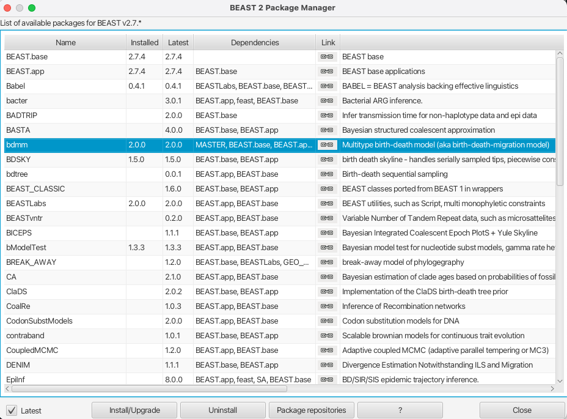
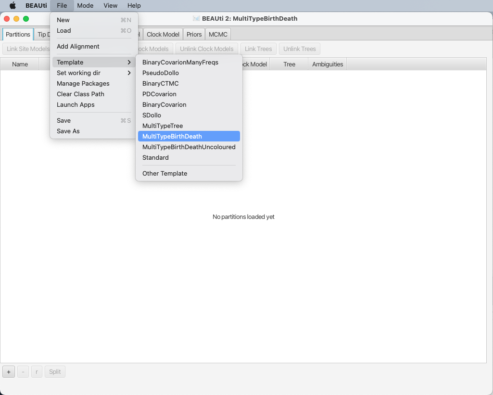
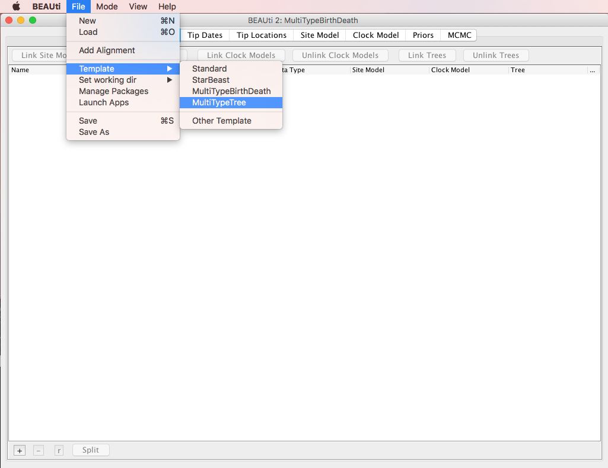
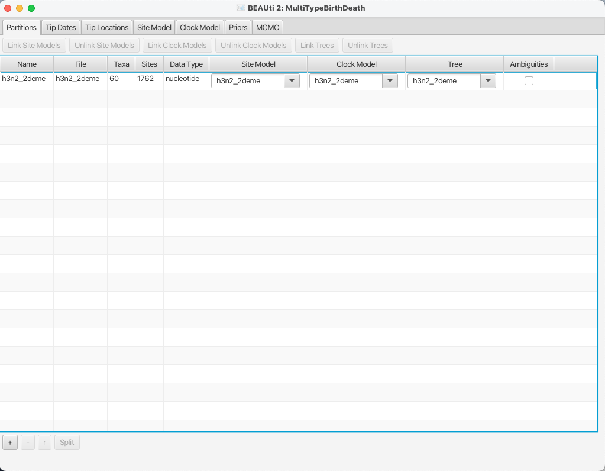
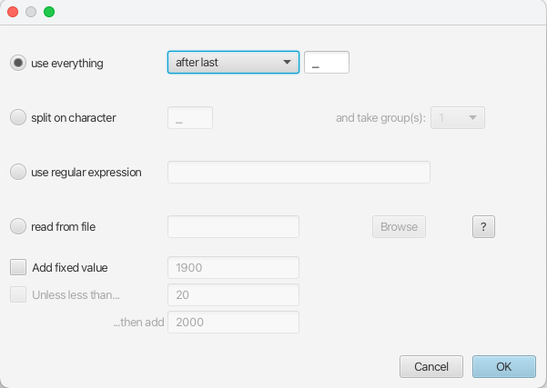

# Introduction

In this tutorial (adapted from Tim Vaughan's [Structured Coalescent tutorial](https://github.com/CompEvol/MultiTypeTree/wiki/Beginner's-Tutorial-(short-version))), we will use the [BEAST 2](http://www.beast2.org/) package
[bdmm](https://github.com/denisekuehnert/bdmm) to perform a Bayesian
phylogenetic analysis of an influenza data set using the multi-type birth-death
model.
(Note that both, the structured coalescent and the multi-type birth-death model, are tree priors implemented in BEAST2. Both of them utilize the multi-type tree structure of the MultiTypeTree package. While the structured coalescent is part of the MultiTypeTree package, the multi-type birth-death model has its own package bdmm (aka birth-death migration model).)


The data set used in this tutorial is a thinned (60 sequence) subset of the
(980 sequence) data set used in the publication [Vaughan et al.,
2014](http://dx.doi.org/10.1093/bioinformatics/btu201), which in turn was
assembled from publicly-available data sets provided by various authors on
[GenBank](http://www.ncbi.nlm.nih.gov/genbank/).

## Software Requirements

In order to proceed, ensure you have the latest version (currently 2.4) of
[BEAST 2](http://www.beast2.org/) installed.  To analyze the inference results
you'll also need a recent version of
[Tracer](http://tree.bio.ed.ac.uk/software/tracer/) and an up-to-date version of 
[Google Chrome](http://www.google.com/chrome) or
[Mozilla Firefox](https://www.mozilla.org/en-US/firefox/).


## Installing the bdmm package

You can easily install this package via BEAUti's package manager.  To do this, follow these steps:

1. Start BEAUti
2. From the *File* menu, select *Manage packages*.
3. Find "bdmm" in the list of packages shown, select it and then click "Install/Upgrade":

<figure>
	<a id="fig:"></a>
	
	<!--figcaption>Figure 1:.</figcaption-->
</figure>
<br>

(Note the actual version of bdmm may differ from the version shown in
the figure. This is normal.)

Finally, **restart BEAUti.**  This is very important.  Strange behaviour may result if you do not restart the program.

# Setting up the analysis using BEAUti

## Loading the Template

A BEAUTI template defines the basic structure and contents of your XML file. Because by default BEAUTI will construct an XML file with standard BEAST trees, rather than MultiTypeTrees, we cannot use the default template (Standard.xml). Hence, from the *File* menu, select *Template* and then choose *MultiTypeBirthDeath*. 

<figure>
	<a id="fig:"></a>
	
	<!--figcaption>Figure 1:.</figcaption-->
</figure>
<br>


## Loading the data

Once the template is loaded, we can load in our example sequence data.  In our case, this data is stored in a FASTA file, the first few lines of which look like this:

```
> EU856841_HongKong_2005.34246575
-----------GGGATAATTCTATTAACCATGAAGACTATCATTGCTTTGAGCTACATTT
> EU856989_HongKong_2002.58356164
--CAAAAGCAGGGGATAATTCTATTAACCATGAAGACTATCATTGCTTTGAGCTACATTT...
> CY039495_HongKong_2004.5890411
------------------TTCTATTAACCATGAAGACTATCATTGCTTTGAGCTACATTC...
> EU856853_HongKong_2001.17808219
---------------------TATTAACCATGAAGACTATCATTGCTTTGAGCTACATTC...
> CY010084_NewZealand_2005.62739726
---------------------TATTAACCATGAAGACTATCATTGCTTTGAGCTACATTC...
> CY007387_NewZealand_2004.63287671
---------------------TATTAACCATGAAGACTATCATTGCTTTGAGCTACATTC...
> CY012432_NewZealand_2000.81643836
---------------------------CCATGAAGACTATCATTGCTTTGAGCTACATTT...
```

The lines beginning with ">" are labels for the sequences immediately
following.  In general, these labels have no special format, but in this file
each label is an underscore-delimited triple.  The first element of each triple
is the GenBank accession number of the sequence, the second is the geographical
region from which it was sampled, and the third is the time at which it was
sampled measured in calendar years or fractions thereof.  (The ellipses are not
in the file, but are used here to indicate that sequence has been truncated.)

In this tutorial we will be using the influenza sequence data which is
distributed with MultiTypeTree.  To make this easy to find, open the *File*
menu and select *Set working dir*.  Then, from the submenu that appears, select
*MultiTypeTree*.

<figure>
	<a id="fig:"></a>
	
	<!--figcaption>Figure 1:.</figcaption-->
</figure>
<br>


(This step is not required when loading your own data.)

To load the file, open the *File* menu and select *Add alignment*.  This
will open a file selection dialog box.  The example influenza sequence data
file is named `h3n2_2deme.fna`.  Assuming you have followed the previous step to set
the working directory, this can be found in the `examples/` directory shown
when the file selection dialog box loads.

Once this file is loaded, your BEAUti screen should look something like the following:
<figure>
	<a id="fig:"></a>
	
	<!--figcaption>Figure 1:.</figcaption-->
</figure>
<br>

## Setting up dates

Once the data is loaded, the next step is to specify the times at which the sequences were sampled:

1. Select the "Tip Dates" panel.
2. Check the "Use tip dates" checkbox.
3. Click the "Guess" button at the top-right of the panel. This opens a dialog
   that allows sample times to be loaded from a file or inferred (guessed) from
   the sequence labels.
4. Because the times are included as the last element of the
   underscore-delimited sequence names, choose the "use everything" radio
   button and select "after last" from the drop-down menu. (Note that the
   underscore character is already chosen as the delimiter.)

<figure>
	<a id="fig:"></a>
	
	<!--figcaption>Figure 1:.</figcaption-->
</figure>
<br>

After clicking "OK" you should find that the tip date table is populated with
times that match those in the sequence headers, and that the last column of the
table contains "heights" (times before most recent sample) calculated from the
times:

<figure>
	<a id="fig:"></a>
	
	<!--figcaption>Figure 1:.</figcaption-->
</figure>
<br>

## Setting up locations

Now that we've specified the sampling times, we move on to specifying the sampling
locations.  To do this, we follow a very similar set of steps to those we used
to set the sample times:

1. Select the "Tip Locations" panel.  You'll find that the locations are
   already populated with default values.
2. Click the "Guess" button at the top-right of the panel.  This opens the same
   dialog that we saw in the previous section.
3. Because the locations are included as the second element of the
   underscore-delimited sequence names, choose the "split on character"
   radio button and select group 2 from the drop-down menu.  (Note again that the
   underscore character is already chosen as the delimiter.)

<figure>
	<a id="fig:"></a>
	
	<!--figcaption>Figure 1:.</figcaption-->
</figure>
<br>

After clicking "OK" you should find that the tip location table is populated
with locations that match those in the sequence headers, as follows:

<figure>
	<a id="fig:"></a>
	
	<!--figcaption>Figure 1:.</figcaption-->
</figure>
<br>

## Substitution model

For this analysis, we will use the HKY substitution model with 4 gamma categories and estimated base frequencies. To configure this in BEAUti, switch to the "Site Model" panel, change the number of gamma categories and select HKY from the drop-down menu (the default option is JC69). We also want the proportionInvariant parameter to be nonzero and estimated to account for invariant sites in our alignment. 

The BEAUti panel should now look like the following:

<figure>
	<a id="fig:"></a>
	
	<!--figcaption>Figure 1:.</figcaption-->
</figure>
<br>

Note that the "Substitution rate" defined on this panel should be left
non-estimated - we use the "Clock rate" defined in the "Clock Model" panel to
determine the average per unit time rate of sequence evolution.  Used this way,
the "substitution rate" is therefore not actually a rate (it's actually
dimensionless) but is instead a rate multiplier that in our case we fix at 1.

## Defining Clock model

For this analysis we assume a strict clock. Since our alignment contains
sequences sampled at different times and those times are measured in years, we
must use a real clock rate expressed in units of expected substitutions per
site per year.  Usually the precise value is unknown and so the default behaviour of BEAUti is to assume this rate is to be estimated.  We set the clock rate to 0.005, which we know is much closer to the truth than the default 1, to speed up mixing. The Clock Model panel should now look like this:

<figure>
	<a id="fig:"></a>
	
	<!--figcaption>Figure 1:.</figcaption-->
</figure>
<br>

## Adjusting Priors

Because bdmm is a model-based prior on the (multi-type) tree distribution, setting up the "Priors" panel is a particularly important part of setting up this analysis.

It is important to change the time at which sampling started, counting from the time of the last sample. In our case, the time between the first and last sample is 5.57 (rounded UP). Note, that the sampling proportion has 4 entries, let's call them [s11,s12,s21,s22]. The values s11 and s12 belong to type 1 (HongKong) and s21, s22 belong to type 2 (New Zealand). The values s11 and s21 belong to the first interval, which is the time before the first sample, which is why s11=s21=0. 


<figure>
	<a id="fig:"></a>
	
	<!--figcaption>Figure 1:.</figcaption-->
</figure>
<br>

When you expand the tree prior element, you can change the condition on survival setting. We'll leave the box checked. 

<figure>
	<a id="fig:"></a>
	
	<!--figcaption>Figure 1:.</figcaption-->
</figure>
<br>

Ensure the value shown in the "State Number" spinner is equal to the
   number of types present in your model. In this case, the default value of 2
   is correct, but in general you should check your data and change this value accordingly. 

Click the arrows on the left-hand side of each parameter to alter
   the details of these priors. For example, we will set the rateMatrix prior distribution to Exp(1):

<figure>
	<a id="fig:"></a>
	
	<!--figcaption>Figure 1:.</figcaption-->
</figure>
<br>

We will use the default set-up for the MCMC and save our file as usual. 


# Running the analysis using BEAST

To run the analysis, simply start BEAST 2 in the manner appropriate for your
platform, then select the file you generated in the last section as the input
file.  (Refer to the documentation provided at
[www.beast2.org](http://www.beast2.org/) for detailed instructions.)

# Analyzing the results

The results of the analysis primarily consist of two parts:

1. The parameter log, which is written to the file `h3n2-bdmm-v2-samplingPrior.log`.
2. The tree log, which is written to `h3n2-bdmm-v2-samplingPrior.h3n2_2deme.trees`.

In addition, the file `h3n2-bdmm-v2-samplingPrior.h3n2_2deme.map.trees` contains the running
estimate of the MAP tree as a function of MCMC step number, while the file
`h3n2-bdmm-v2-samplingPrior.h3n2_2deme.typedNode.trees` is the TreeAnnotator-compatible file
we'll use to assemble a summary tree.

## Parameter log file analysis

We can use the program [Tracer](http://tree.bio.ed.ac.uk/software/tracer/) to
view the parameter log file. To do this, start Tracer and then press the "+"
button in the top-left hand corner of the window (under "Trace files"). Select
the log file for this analysis (`h3n2_2deme.log`) from the file selection dialog box.
The "Traces" table will then be populated with parameters and summary
statistics corresponding to our multitype birth-death analysis.

Important traces are:
* `R0.t:h3n2_2deme1` and `R0.t:h3n2_2deme2`: These give the effective reproduction numbers for deme 1 (Hongkong) and 2 (New Zealand), respectively.

* `rateMatrix.t:h3n2_2deme1`	`rateMatrix.t:h3n2_2deme2`: These give the (per lineage per year) migration rates from deme 1 to 2 and vice versa.

* `Tree.t:h3n2_2deme.count_HongKong_to_NewZealand`: these give the actual number of ancestral
  migrations from HongKong to New Zealand.

The panels tabs at the top-right of the window can be used to display one or
more selected traces in various ways.  For example, selecting the two R0 traces and choosing the "Marginal prob distribution" panel results in the following useful comparison between the sampled population size
marginal posterior distributions:

<figure>
	<a id="fig:"></a>
	
	<!--figcaption>Figure 1:.</figcaption-->
</figure>
<br>

Note that some of the ESS values are still less than 200 - the arbitrary
threshold for acceptability. If this analysis were part of a serious study you
would want to run the chain for another few million iterations to improve
these. (In BEAST 2, analyses can be resumed - the samples you've already
acquired will not be wasted.) For the purposes of this tutorial, however, these
values are acceptable.

## Tree log visualization

The popular phylogenetic tree visualizer
[FigTree](http://tree.bio.ed.ac.uk/software/figtree/) can be used to visualize
the sampled trees.  Be warned, however, that FigTree currently
takes an extremely long time to load even relatively small (a few megabyte)
MultiTypeTree logs.

For this reasons we suggest using [IcyTree](http://tgvaughan.github.io/icytree)
to view tree log files and maybe switching to FigTree to visualize summary
trees as discussed in the next section.  (Also, IcyTree can be used to export
individual trees from a large log file for subsequent viewing using FigTree.)
IcyTree is a tree viewer that runs in a web browser.  It runs best under recent
versions of [Google Chrome](http://www.google.com/chrome) and [Mozilla
Firefox](https://www.mozilla.org/en-US/firefox/) (in that order).

To view MultiTypeTree log files using IcyTree, simply navigate to the IcyTree
web page, select "Load from file" from the "File" menu, then select one of the
tree log files using the file selection dialog. Once the file is loaded you
will see the first tree it contains.  In order to select a different tree, move
the mouse pointer over the box in the lower-left corner of the window.  This
box will expand to a small dialog containing buttons allowing you to navigate
between trees. The '<' and '>' buttons move in steps of 1 tree, while '<<' and
'>>' move 10% of the tree file per click.  You can also directly enter the
index of a tree.  (Note that there are keyboard shortcuts for almost all
commands in IcyTree and that these can be found by selecting "Keyboard
shortcuts" from the "Help" menu.)

Initially the trees edges will be uncoloured.  To colour the edges according to
the edge type, open the "Style" menu, navigate to the "Colour edges by" submenu
and select "type". A legend and axis can be added by choosing "Display legend"
and "Axis > Age" from the same menu.

The following shows the final tree of `h3n2-bdmm-v2-samplingPrior.h3n2_2deme.map.trees` in IcyTree, which
represents our sampled estimate of the MAP multi-type tree:

<figure>
	<a id="fig:"></a>
	
	<!--figcaption>Figure 1:.</figcaption-->
</figure>
<br>

While IcyTree is useful for rapidly visualizing the results of an analysis, it
is not nearly as feature-rich as FigTree and not as capable for producing
publication-quality graphics.  Happily, however, IcyTree can extract single
trees from larger log files. Simply navigate to the desired tree, open the
"File" menu, choose the "Export tree as" submenu and select "NEXUS file". (It
is important to select "NEXUS" instead of "Newick" as the Newick format does
not support the annotations that MultiTypeTree uses to mark the edge types.)

## Producing a summary tree using TreeAnnotator

While it is tempting to view the MAP tree shown above as the primary result of
the phylogenetic side of our analysis it is very important to remember that
this is only a point estimate and says nothing about the uncertainty present in
the result.  This is an important drawback, as we have done a full Bayesian
analysis and have access to a large number of samples from the full posterior
in the tree log files. The MAP tree discards almost all of this information.

We can make better use of our raw analysis results by using the TreeAnnotator
program which is distributed with BEAST to analyze the
`typedNode` trees which were produced by our MCMC run.  To do this,
simply load TreeAnnotator and select the `typedNode` tree file as
the input file and `h3n2-bdmm-v2-samplingPrior.h3n2_2deme.summary.trees` as the output file.  Select "Mean
heights" from the "Node heights" menu and set the burn-in percentage to 10:

<figure>
	<a id="fig:"></a>
	
	<!--figcaption>Figure 1: .</figcaption-->
</figure>
<br>

Pressing the "Run" button will now produce an annotated summary tree.

To visualize this tree, open IcyTree once more (maybe open it in a new browser
tab), choose File->Open, then select the file
`h3n2_2deme.h3n2_2deme.summary.tree` using the file selection dialog. Follow
the instructions provided for the MAP tree above to colour the tree by the
"type" attribute and add the legend and time axis. In addition, open the Style
menu and from the "Node height error bars" sub-menu select "height_95%_HPD" to
add error bars to the internal node heights. Also, open the Style menu and from
the "Edge opacity" sub-menu select "type.prob". This will cause the edges to
become increasingly transparent as the posterior probability for the displayed
colour decreases.

Once these style preferences have been set, you should see something similar to
the following:

<figure>
	<a id="fig:"></a>
	
	<!--figcaption>Figure 1:.</figcaption-->
</figure>
<br>

Here we have a full consensus tree annotated by the locations at coalescence
nodes and showing node height uncertainty, with the widths of the edges
representing how certain we can be of the location estimate at each point on
the tree. This is a much more comprehensive summary of the phylogenetic side of
our analysis.

One thing to pay attention to here is that the most probable root location is
given by the summary tree to be Hong Kong (under our model which assumes that
only Hong Kong and New Zealand exist). By hovering the mouse cursor over the
tiny edge above the root will bring up a table in which posterior probability
of the displayed root location (`type.prob`) can be seen to be approximately
90%. The analysis therefore strongly supports a Hong Kong origin over a New
Zealand origin.  

[Very useful final notes from Tim](https://github.com/CompEvol/MultiTypeTree/wiki/Beginner%27s-Tutorial-%28short-version%29#final-notes)


----

# Useful Links

- [Bayesian Evolutionary Analysis with BEAST 2](http://www.beast2.org/book.html) 
- BEAST 2 website and documentation: [http://www.beast2.org/](http://www.beast2.org/)
- BEAST 1 website and documentation: [http://beast.bio.ed.ac.uk](http://beast.bio.ed.ac.uk)
- Join the BEAST user discussion: [http://groups.google.com/group/beast-users](http://groups.google.com/group/beast-users) 

----

This tutorial was written by Author Name for [Taming the BEAST](https://taming-the-beast.github.io) and is licensed under a [Creative Commons Attribution 4.0 International License](http://creativecommons.org/licenses/by/4.0/). 

----

# Relevant References



