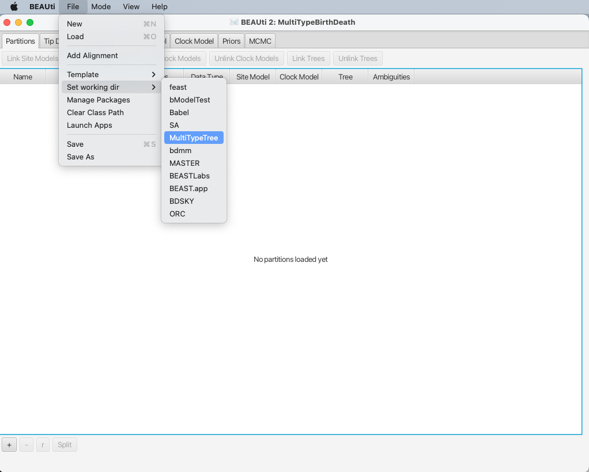
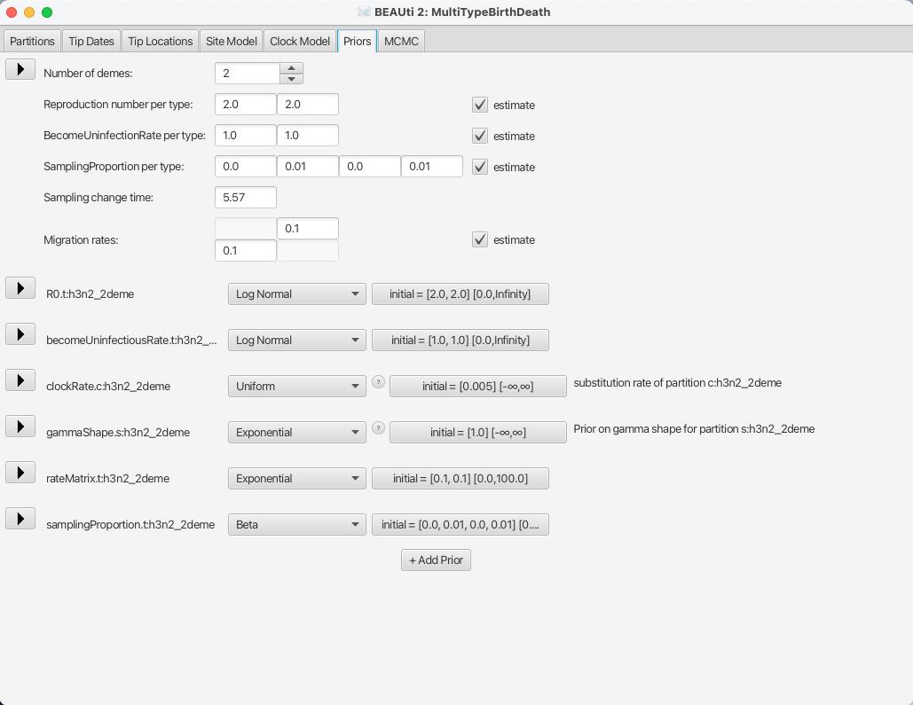

# Introduction

In this tutorial we will use the [BEAST2](http://www.beast2.org/)
[bdmm](https://github.com/denisekuehnert/bdmm) package to perform a Bayesian
phylogenetic analysis of an influenza data set using the multi-type birth-death
model .

<!--(Note that both the structured coalescent and the multi-type birth-death model are tree priors implemented in BEAST2. Both of them utilize the multi-type tree structure of the MultiTypeTree package. While the structured coalescent is part of the MultiTypeTree package, the multi-type birth-death model has its own package bdmm (aka birth-death migration model).)-->


The data set used in this tutorial is a thinned 60 sequence subset of the
980 sequence H3N2 influenza data set used in the publication , which in turn was
assembled from publicly-available data sets provided by various authors on
[GenBank](http://www.ncbi.nlm.nih.gov/genbank/).

## Software Requirements

### BEAST2 - Bayesian Evolutionary Analysis Sampling Trees

BEAST2 is a free software package for Bayesian evolutionary analysis of molecular sequences using MCMC and strictly oriented toward inference using rooted, time-measured phylogenetic trees. This tutorial is written for BEAST v{{ page.beastversion }} .


### BEAUti2 - Bayesian Evolutionary Analysis Utility

BEAUti2 is a graphical user interface tool for generating BEAST2 XML configuration files.

Both BEAST2 and BEAUti2 are Java programs, which means that the exact same code runs on all platforms. For us it simply means that the interface will be the same on all platforms. The screenshots used in this tutorial are taken on a Mac OS X computer; however, both programs will have the same layout and functionality on both Windows and Linux. BEAUti2 is provided as a part of the BEAST2 package so you do not need to install it separately.


### TreeAnnotator

TreeAnnotator is used to summarise the posterior sample of trees to produce a maximum clade credibility tree. It can also be used to summarise and visualise the posterior estimates of other tree parameters (e.g. node height).

TreeAnnotator is provided as a part of the BEAST2 package so you do not need to install it separately.


### Tracer

Tracer ([http://tree.bio.ed.ac.uk/software/tracer](http://tree.bio.ed.ac.uk/software/tracer)) is used to summarize the posterior estimates of the various parameters sampled by the Markov Chain. This program can be used for visual inspection and to assess convergence. It helps to quickly view median estimates and 95% highest posterior density intervals of the parameters, and calculates the effective sample sizes (ESS) of parameters. It can also be used to investigate potential parameter correlations. We will be using Tracer v{{ page.tracerversion }}.

### IcyTree

IcyTree ([https://icytree.org](https://icytree.org)) is a browser-based phylogenetic tree viewer. It is intended for rapid visualisation of phylogenetic tree files. It can also render phylogenetic networks provided in extended Newick format. IcyTree is compatible with current versions of Mozilla Firefox and Google Chrome.

<!-- and an up-to-date version of
[Google Chrome](http://www.google.com/chrome) or
[Mozilla Firefox](https://www.mozilla.org/en-US/firefox/).-->


## Installing the `bdmm` package

You can easily install the `bdmm` package via BEAUti's package manager.  To do this, follow these steps:

1. Start BEAUti;
2. In the application menu, `File > Manage packages`.
3. Find `bdmm` in the list of packages shown, select it and then click `Install/Upgrade`.

The BEAUTi window should look similar to what is shown in [Figure 1](#fig:install-bdmm).
Note the actual version of `bdmm` may differ from the version shown in the figure, which is perfectly normal.
Also note that `bdmm` depends on the `MultiTypeTree` package. And on `MASTER` from version v0.3.0 upward. BEAUTi will install the dependencies automatically once you select to install `bdmm`.

<figure>
	<a id="fig:install-bdmm"></a>
	
	<figcaption>Figure 1: Install bdmm.</figcaption>
</figure>
<br>

Finally, **restart BEAUti.**  The restart is necessary for the packages to be successfully installed.

If you get an error message stating that you are missing a package on which `bdmm` depends, install that package manually using the package manager as done above, and **restart BEAUti** again.

# Setting up the analysis using BEAUti

## Loading the Template

A BEAUTi template defines the basic structure and contents of your XML configuration file.
By default BEAUTi will construct an XML file with standard uncoloured BEAST trees, however `bdmm` uses coloured trees which are defined in the `MultiTypeTree` package.
To use the appropriate template for the configuration file, select `File > Template > MultiTypeBirthDeath`, as shown in [Figure 2](#fig:choose-bdmm).

<figure>
	<a id="fig:choose-bdmm"></a>
	
	<figcaption>Figure 2: Load the MultiTypeBirthDeath template.</figcaption>
</figure>
<br>


## Loading the data

Once the template is loaded, we can load in our example sequence data.  In our case, this data is stored in a FASTA file, the first few lines of which look like this (the sequences have been truncated for better readability):

```
> EU856841_HongKong_2005.34246575
-----------GGGATAATTCTATTAACCATGAAGACTATCATTGCTTTGAGCTACATTT...
> EU856989_HongKong_2002.58356164
--CAAAAGCAGGGGATAATTCTATTAACCATGAAGACTATCATTGCTTTGAGCTACATTT...
> CY039495_HongKong_2004.5890411
------------------TTCTATTAACCATGAAGACTATCATTGCTTTGAGCTACATTC...
> EU856853_HongKong_2001.17808219
---------------------TATTAACCATGAAGACTATCATTGCTTTGAGCTACATTC...
> CY010084_NewZealand_2005.62739726
---------------------TATTAACCATGAAGACTATCATTGCTTTGAGCTACATTC...
> CY007387_NewZealand_2004.63287671
---------------------TATTAACCATGAAGACTATCATTGCTTTGAGCTACATTC...
> CY012432_NewZealand_2000.81643836
---------------------------CCATGAAGACTATCATTGCTTTGAGCTACATTT...
```

The lines beginning with ">" are labels for the sequences immediately
following.  In general, these labels have no special format, but in this file
each label is an underscore-delimited triple.  The first element of each triple
is the GenBank accession number of the sequence, the second is the geographical
region from which it was sampled, and the third is the time at which it was
sampled measured in calendar years or fractions thereof.

In this tutorial we will be using the influenza sequence data which can be found in the `examples` folder of the `MultiTypeTree` package.
To make it easier to find when loading the alignment, you can optionally set the working directory of BEAST2 to `MultiTypeTree`.
This will make BEAUTi open the appropriate package folder when you look for the alignment.
To set the working directory, select `File > Set working dir > MultiTypeTree`, as shown in [Figure 3](#fig:working-dir).

<figure>
	<a id="fig:working-dir"></a>
	
	<figcaption>Figure 3: Optional step: set the working directory to MultiTypeTree.</figcaption>
</figure>
<br>

To load the file, select `File > Add alignment`.

This will open a file selection dialog box.  The example influenza sequence data
file is named `h3n2_2deme.fna`.
Assuming you have followed the previous step to set the working directory, this can be found in the `examples/` directory shown when the file selection dialog box appears.
In case you have not followed the previous step you will have to locate the folder containing the `MultiTypeTree` package and look for the `examples/` folder there.

Once the sequence file is loaded, your BEAUti screen should look similar to what is shown in [Figure 4](#fig:alignment).

<figure>
	<a id="fig:alignment"></a>
	
	<figcaption>Figure 4: The alignment loaded into BEAUti.</figcaption>
</figure>
<br>

## Setting up dates

Once the data is loaded, the next step is to specify the times at which the sequences were sampled:

1. Select the `Tip Dates` panel.
2. Check the `Use tip dates` checkbox.
3. Click the `Auto-configure` button at the top-right of the panel.
This opens a dialog that allows sample times to be loaded from a file or inferred (guessed) from the sequence labels.
4. Because the times are included as the last element of the underscore-delimited sequence names, choose the `use everything` radio button and select `after last` from the drop-down menu. The default delimiter is already the underscore, so there is no need to change that.

The date parsing setup will look as shown in [Figure 5](#fig:tip-dates).

<figure>
	<a id="fig:tip-dates"></a>
	
	<figcaption>Figure 5: Guessing the tip dates.</figcaption>
</figure>
<br>

After clicking `OK` you should find that the tip date table is filled with
times that match those in the sequence headers, and that the last column of the
table contains heights, i.e. times before most recent sample, calculated from the times.
The BEAUTi panel should look as shown in [Figure 6](#fig:tip-dates).

<figure>
	<a id="fig:tip-dates-set"></a>
	
	<figcaption>Figure 6: Sampling dates as seen in BEAUti.</figcaption>
</figure>
<br>

## Setting up locations

Now that we've specified the sampling times, we move on to specifying the sampling locations.
To do this, we follow a very similar set of steps to those we used to set the sample times:

1. Select the `Tip Locations` panel. You'll find that the locations are already filled with a single default value – `NOT_SET`.
2. Click the `Guess` button at the top-right of the panel. This opens the same dialog that we saw in the previous section when setting up the dates.
3. The locations are included as the second element of the underscore-delimited sequence names.
Therefore we choose the `split on character` radio button and select group `2` from the drop-down menu.
Note again that the underscore character is already chosen as the delimiter.

The location parsing setup will look as shown in [Figure 7](#fig:tip-types).

<figure>
	<a id="fig:tip-types"></a>
	
	<figcaption>Figure 7: Guessing the locations.</figcaption>
</figure>
<br>

After clicking `OK` you should find that the tip location table is filled with locations that match those in the sequence titles.
The BEAUTi panel should look as shown in [Figure 8](#fig:tip-types-set).

<figure>
	<a id="fig:tip-types-set"></a>
	
	<figcaption>Figure 8: The locations in BEAUti.</figcaption>
</figure>
<br>

## Setting the substitution model

For this analysis, we will use the HKY substitution model with 4 gamma categories and estimated base frequencies.
To configure this in BEAUti, switch to the `Site Model` panel.
First, we need to set up the rate category count.
To approximate the continuous gamma rate distribution BEAST2 uses the discrete gamma distribution, where sites are divided into k equally probable rate categories.
In general, 4-6 categories work well for most datasets, while having more categories involve a lot of computation at little precision gain, so we set the `Gamma category count` to 4.
We would also like to estimate the `Shape` parameter, which describes the shape of the continuous gamma distribution we approximate.
To do so, we need to set it to a non-zero value (e.g. the default 1.0) and tick the `estimate` checkbox.
While the gamma categories account for rate variation, allowing some sites to have an evolutionary rate of 0 can improve fit to real data.
To speed up the analysis we will fix this to the actual proportion of invariant sites we have in our alignment, which is 0.867.

Next, to set up the substitution model, select `HKY` from the drop-down menu (the default option is `JC69`).
We would like to estimate the kappa parameter of HKY, so we leave the `Kappa` at the default value of 2.0 and leave the `estimate` checkbox checked.
We would also like to estimate nucleotide frequencies, so we leave the `Frequencies` parameter at the default value (`Estimated`).
The BEAUti panel should now look as shown in [Figure 9](#fig:site-model).

<figure>
	<a id="fig:site-model"></a>
	
	<figcaption>Figure 9: Setup of the site model.</figcaption>
</figure>
<br>

Note that the `Substitution rate` defined on this panel should not be estimated - we use the `Clock rate` defined in the `Clock Model` panel to
determine the average per unit time rate of sequence evolution.
This way, the `Substitution rate` is not actually a rate, but rather a rate multiplier that we fix to 1 to allow parameter identifiability.

## Setting the clock model

To speed up the analysis we will assume a strict clock for this small dataset.
dataset. However, the selection of a clock model for a different, real analysis should not be taken lightly.
Since our alignment contains sequences sampled at different times and those times are measured in years, we must use a clock rate expressed in units of expected substitutions per site per year.
Usually the precise value is unknown and so the default behaviour of BEAUti is to assume this rate has to be estimated.
To speed up mixing we set the starting value of the `Clock rate` to 0.005, which we know from research to be much closer to the truth than the default value of 1.
The `Clock Model` panel should now look as shown in [Figure 10](#fig:strict-clock).

<figure>
	<a id="fig:strict-clock"></a>
	
	<figcaption>Figure 10: Fix the clock rate to speed up mixing.</figcaption>
</figure>
<br>

## Adjusting Priors

### Setting up the `bdmm` tree prior

`bdmm` defines a prior on the multi-type tree distribution.
Thus it is particularly important for the analysis that we properly set up the priors.
First, let's talk about the values that need to be set on the `Priors` panel.
The first panel that you see at the top is the tree prior.

`bdmm` is a model that can be used to explain data that is clearly divided into separate partitions, or demes.
(We will use the terms deme, partition and type interchangeably here.)
The demes can be geographical locations, as in our example, but the sequences can also be separated through other means than that, e.g. by a specific drug resistance mutation (strains can develop/lose drug resistance and thus move between demes, but can not transfer between demes otherwise), or location in the body (for example, for localised infections caused by the same agent).
In this dataset we have strains from 2 different locations, New Zealand and Hong Kong, so the `Number of demes` should be set to 2, which also is the default value.
Next, `bdmm` lets you estimate the `Reproduction number per type` and the `BecomeUninfectiousRate per type`.
This will let us see the differences in reproduction fitness and speed of recovery between the two locations, so we leave the `estimate` checkboxes checked.
We can leave the starting values at default as it will not influence the inference a lot.

The next important thing one should take care of is setting the sampling proportions appropriately.
In general, the trees that we build go back in time much further than the first sample that we have.
If we set the same sampling proportion for the whole time period from our estimated tree origin to the time of the last sample, we will most likely run into trouble, as `bdmm` will try to produce a tree that has the same sampling proportion for the whole time, but no samples in the past and a lot of samples towards the present.
In order to remove that bias from the trees, we need to make sure that we only have non-zero sampling starting from the first sample date (unless we know that there really weren't
any related cases before the first sampled case).
To do so, let's look at the `SamplingProportion per type` field.
You will see that it has 4 values, which correspond to two values per type, lets call them [v1,v2,v3,v4].
v1 and v2 are the values for the first and second time interval for the first deme, and v3 and v4 are the values for the second deme.
Thus, to do what we want we need to set the values v1 and v3 to zero.
Because BEAST2 will use scalers to sample new values for the sampling proportions, the values which we set to 0 will remain so.
Next, we also need to set the `Sampling change time` to the time slightly before the first sample.
If we look back at the `Tip dates` panel, we can see that our oldest sample is the one labelled as `EU856904_HongKong_2000.09863014`, for which the height, or the length of time from the first sample and the last, is 5.569863.
We set the sampling change time in time units from the most recent sample and we need to make sure we include the first sample, thus we set the `Sampling change time` to 5.57, which is the height of the first sample rounded slightly up (and confirm the change with ENTER).
The final setup of the tree prior can be seen in [Figure 11](#fig:tree-prior).

<figure>
	<a id="fig:tree-prior"></a>
	
	<figcaption>Figure 11: Set the change time for the sampling proportion so it is zero before the time of the first sample.</figcaption>
</figure>
<br>

<!--When you expand the tree prior element, you can change the condition on survival setting. We'll leave the box checked.

<figure>
	<a id="fig:"></a>
	
	<figcaption>Figure 11: Condition on survival.</figcaption>
</figure>
<br>-->

#### What if you have more demes?

First things first, for an analysis with more demes you need to set the `Number of demes` to the appropriate value, e.g. N, that actually corresponds to the number of demes in the dataset.
When you do that, the dimensions of the parameters `Reproduction number`, `BecomeUninfectiousRate`, `SamplingProportion` and `Migration rates` will change.
The `Reproduction number` and the `BecomeUninfectiousRate` will have as many values as you have demes.
The dimensionality of the `SamplingProportion` will be the number of demes times 2, so in case you have 4 demes your sampling proportion will need 8 values.
You can view this parameter as a matrix of 2 x N values, which is flattened by row.
The first column reflects the sampling rate before first sample and all of the values in it should be set to 0.
The `Sampling change time` obviously does not change dimensionality, but has to be set to the appropriate time for your dataset.
Finally, the `Migration rates` will have N * (N - 1) entries.
As one can imagine, the matrix should have the dimensions of N * N, however since there is no migration from a deme to itself (values on the diagonal of the matrix), we subtract N values from the dimensionality, getting N * (N - 1).

### Setting up other priors

By default, BEAST2 provides you with a prior distribution for each of the parameters of your model.
This is done because otherwise BEAUTi will have a hard time displaying all of the parameters without any settings provided.
Unfortunately, this means that some priors are very generic, and, moreover, some priors are in fact, improper – the distribution does not integrate to one.
This means that while the default setup might work and the runs will eventually mix, it can happen that the values are meaningless.

So, let us go through the important parameters and set priors according to the information we have about our dataset.
The first important parameter is R<sub>0</sub>.
In epidemiology, the basic reproduction number, R<sub>0</sub>, of an infection is the number of secondary cases one case generates on average over the course of its infectious period, in an otherwise uninfected population.
The default prior sets the median value of the distribution to e<sup>0</sup> = 1, which will fit the endemic case of influenza.

<!-- todo: (ideally) adjust analysis files to remove the upper bound of 10, it shouldn't be necessary -->

<figure>
	<a id="fig:R0-prior"></a>
	
	<figcaption>Figure 12: Set the prior for the R<sub>0</sub>.</figcaption>
</figure>
<br>

Next, we should adjust the prior for the rate of clearing the infection, which is labelled as `becomeUninfectiousRate.t:h3n2_2deme`.
The value of the rate, say x, is the reciprocal of the average time a person with influenza is infectious, 1/x.
From what we know about influenza we can say that an average infection lasts for about a week, however we would not want to impose too strong of a prior on this parameter.
Let us change the distribution for this parameter to a `LogNormal` and tick the `Mean in Real Space` checkbox to make the setting easier.
So, for a mean time of recovery of 7 days we need to set the mean of our distribution to 365/7  52.14 (or to 52 for simplicity).
Bear in mind that our time units are years, so we can not just set the rate to 1/7.
This prior will ensure that we mainly sample realistic parameter values, but still gives BEAST2 quite a lot of freedom to go to extreme values if need be, as the 95% highest density interval for the prior is [4.44, 224], or [1.63, 82.21] infectious days.
You can see the setup in [Figure 13](#fig:bUR-prior).

<figure>
	<a id="fig:bUR-prior"></a>
	
	<figcaption>Figure 13: Set the prior for the rate of recovery.</figcaption>
</figure>
<br>

We will also set the prior for the clock rate to a distribution that is in accordance with what we know about RNA viruses, which is that in general their mean substitution rate is around  10^(-3).
We shall set the distribution for `clockRate.c:h3n2_2deme` to `Log Normal` with the mean of 0.001, with the `Mean in Real Space` checkbox checked.
We will leave the `S` parameter (standard deviation) at the default value of 1.25 to allow BEAST2 a lot of freedom in case it is necessary.
The appropriate prior setup can be seen in [Figure 14](#fig:clock-rate-prior).

<figure>
	<a id="fig:clock-rate-prior"></a>
	
	<figcaption>Figure 14: Set the prior for the clock rate.</figcaption>
</figure>
<br>

Lastly, we will set the sampling proportion prior to a more narrow distribution peaked around the very low values, as influenza spreads easily, but only few people actually get sampled.
Taking into account that we are also using a thinned-down version of the dataset, we can use a diffuse prior with the mean around 10<sup>-3</sup>.
The default prior for the sampling proportion is a `Beta` distribution, which is only defined between 0 and 1, making it a natural choice for proportions.
Here, however, we will use a `Log Normal` prior, with the mean `M` at 10<sup>-3</sup> and the standard deviation `S` at 1.25 to allow a lot of variance.
Once again we need to check that the `Mean in Real Space` checkbox is checked, and since the `Log Normal` distribution is defined outside the range of [0, 1] we also need to check that the `Lower` and `Upper` limits are set accordingly. Do so by clicking on the button showing the initial values, next to the distribution type.
You can see the sampling prior setup in [Figure 15](#fig:samplingProportion-prior)

<figure>
	<a id="fig:samplingProportion-prior"></a>
	
	<figcaption>Figure 15: Set the prior for sampling proportion.</figcaption>
</figure>
<br>


For the purpose of this tutorial and given that we know little about the outbreak in question to set strict priors on the `rateMatrix`, we will leave the other priors on the default values, but feel free to through them yourself and verify their sensibility.

## Saving the configuration

Once you are done with setting all the appropriate parameters, you can save the configuration file.
We will leave the `MCMC` panel parameters as they are by default.

# Running the analysis using BEAST

To run the analysis, simply start BEAST 2 in the manner appropriate for your platform, then select the configuration file you generated in the last section as the input.
Unfortunately, this particular run will take quite some time to mix, e.g. on a MacBook Pro with 3.1 GHz Intel Core i5 processor it takes about 3 hours for 10'000'000 samples.
Feel free to run it and observe the results, but for the purpose of finishing the tutorial in a reasonable time, check out the provided log file to see the results.

# Analyzing the results

The results of the analysis primarily consist of two parts:

1. The parameter log, which is written to the file `h3n2-bdmm.log`.
2. The tree log, which is written to `h3n2-bdmm.h3n2_2deme.trees`.

In addition, the file `h3n2-bdmm.h3n2_2deme.map.trees` contains the running
estimate of the MAP tree as a function of MCMC step number, while the file
`h3n2-bdmm.h3n2_2deme.typedNode.trees` is the TreeAnnotator-compatible file
we'll use to assemble a summary tree.

## Parameter log file analysis

We can use the program [Tracer](http://tree.bio.ed.ac.uk/software/tracer/) to view the parameter log file.
To do this, start Tracer and then press the `+` button in the top-left hand corner of the window (under `Trace files`).
Select the log file for this analysis (`h3n2_2deme.log`) from the file selection dialog box.
You can also simply drag your log file from the file browser to the Tracer window.
The `Traces` table will then be populated with parameters and summary
statistics corresponding to our multitype birth-death analysis.
Note that the screen captures below were taken using Tracer 1.6 and may therefore slightly differ from what you see on screen.

Important traces are:

* `R0.t:h3n2_2deme1` and `R0.t:h3n2_2deme2`: These give the effective reproduction numbers for deme 1 (Hong Kong) and 2 (New Zealand), respectively.

* `becomeUninfectiousRate.t:h3n2_deme21` and `becomeUninfectiousRate.t:h3n2_deme22`: These are the rates of recovery for someone with flu in either of the locations.

* `rateMatrix.t:h3n2_2deme1` and `rateMatrix.t:h3n2_2deme2`: These give the (per lineage per year) migration rates from deme 1 to 2 and vice versa.

* `Tree.t:h3n2_2deme.count_HongKong_to_NewZealand`: these give the number of ancestral migrations from Hong Kong to New Zealand on the inferred tree, **backwards in time**.

The tabs at the top-right of the window can be used to display one or more selected traces in various ways.
We can look at the become uninfectious rate by selecting the `becomeUninfectiousRate.t:h3n2_2deme1` trace (see [Figure 16](#fig:tracer-bUR)).
The 95% HPD for the parameter is quite wide ([18.2465, 93.2316]), which is most likely due to the fact that we have very little data, however the mean value is 50.102, which gives us an infectious period of 7.3 days.
Next, selecting the two R<sub>0</sub> traces (`R0.t:h3n2_2deme1` and `R0.t:h3n2_2deme2`) and choosing the `Marginal prob distribution` panel results in useful comparison between the sampled population size marginal posterior distributions (see [Figure 17](#fig:tracer-R0)).
Looking at the posterior distributions we can not see any significant difference in R<sub>0</sub> between the two demes.
While the distributions are visibly different, they cover the same parameter range (deme 1 95% HPD interval [0.991, 1.0247], deme 2 95% HPD interval [0.9096, 1.0413]), so the values are indistinguishable through such analysis.

<figure>
	<a id="fig:tracer-bUR"></a>
	
	<figcaption>Figure 16: Estimated become uninfectious rate marginal posterior.</figcaption>
</figure>
<br>

<figure>
	<a id="fig:tracer-R0"></a>
	
	<figcaption>Figure 17: Estimated R<sub>0</sub> marginal posteriors.</figcaption>
</figure>
<br>

In the case of our pre-cooked analysis all the ESS values are greater than 200 – the arbitrary threshold for acceptability.
However, it might happen that some values have not yet reached the appropriate ESS in the runs that you did on your own.
If this analysis were part of a serious study you would want to run the chain for another few million iterations to improve the ESS values.
In BEAST 2, analyses can be resumed – the samples you already have will not be wasted.

## Tree log visualization

The popular phylogenetic tree visualizer [FigTree](http://tree.bio.ed.ac.uk/software/figtree/) can be used to visualize the sampled trees.
However, Figtree can be quite slow with MultiTypeTree log files, so for this tutorial we suggest using [IcyTree](https://icytree.org/) to view tree log files.
IcyTree is a tree viewer that runs in a web browser, which runs best under recent versions of [Google Chrome](http://www.google.com/chrome) and [Mozilla Firefox](https://www.mozilla.org/en-US/firefox/) (in that order).

To view MultiTypeTree log files using IcyTree, simply navigate to the IcyTree web page, select `Load from file` from the `File` menu, then select the `h3n2-bdmm.h3n2_2deme.trees` tree log file using the file selection dialog.
Alternatively, you can simply drag the log file into your browser window.
Once the file is loaded you will see the first tree it contains.
In order to select a different tree, hover the mouse pointer over the box in the lower-left corner of the window.
This box will expand to a small dialog containing buttons allowing you to navigate between trees.
The `<` and `>` buttons move in steps of 1 tree, while `<<` and `>>` move 10% of the tree file.
You can also directly enter the index of a tree.

Initially the tree edges will be uncoloured.
To colour the edges according to the edge type (this is the strain location in our case), navigate to `Style > Colour edges by` and select `type`.
A legend and axis can be added by choosing `Display legend` and `Axis > Age` from the same menu.
You can browse the trees from your posterior sample (example of the trees you can see in [Figure 18](#fig:icyTree-trees)) to look at the traits they share, however in general we need some sort of a summary to be able to draw conclusions from our tree sample.

<figure>
	<a id="fig:icyTree-trees"></a>
	
	<figcaption>Figure 18: An example of a sampled multi-type tree in IcyTree.</figcaption>
</figure>
<br>

One way of summarising is done by the special `MultiTypeTree` log, which logs the running estimates of the <i>maximum a posteriori</i> multi-type tree over the course of the analysis.
In our case it is the `h3n2-bdmm.h3n2_2deme.map.trees` file.
You can see the last tree from this file, which represents our sampled estimate of the MAP multi-type tree, in [Figure 19](#fig:icyTree-MAP).

<figure>
	<a id="fig:icyTree-MAP"></a>
	
	<figcaption>Figure 19: The final MAP multi-type tree in IcyTree.</figcaption>
</figure>
<br>

## Producing a summary tree using `TreeAnnotator`

While it is tempting to view the MAP tree shown above as the primary result of the phylogenetic side of our analysis it is very important to remember that this is only a point estimate and says nothing about the uncertainty present in the result.
This is an important drawback, as we have done a full Bayesian analysis and have access to a large number of samples from the full posterior in the tree log files.
The MAP tree discards almost all of this information.

We can make better use of our raw analysis results by using the `TreeAnnotator` program which is distributed with BEAST2 to analyze the sample of trees which was produced by our MCMC run.
To do this, simply start `TreeAnnotator` and select the `h3n2-bdmm.h3n2_2deme.typedNode.trees` tree file as the input file and `h3n2-bdmm.h3n2_2deme.summary.trees` as the output file.
We will set the `Burnin percentage` to 10, the `Target tree type` to the `Maximum clade credibility tree` (default) and for the `Node heights` we would like to have `Mean heights`.
The setup can be seen in [Figure 20](#fig:TreeAnnotator-setup).

<figure>
	<a id="fig:TreeAnnotator-setup"></a>
	
	<figcaption>Figure 20: Use TreeAnnotator to produce a summary tree.</figcaption>
</figure>
<br>

Pressing the `Run` button will produce an annotated summary tree.

To visualize this tree, open IcyTree once more (maybe open it in a new browser tab), choose `File > Open`, then select the file `h3n2_2deme.h3n2_2deme.summary.tree` using the file selection dialog.
Follow the instructions provided above to colour the tree by the `type` attribute and add the legend and time axis.
In addition, open the `Style` menu and select `Node height error bars > height_95%_HPD` to add error bars to the internal node heights.
Finally, open the `Style` menu and select `Relative edge width > type.prob`.
This makes the edges become increasingly thinner as the posterior probability for the displayed branch decreases.

Once these style preferences have been set, you should see something similar to the tree shown in [Figure 21](#fig:icyTree-summary).

<figure>
	<a id="fig:icyTree-summary"></a>
	
	<figcaption>Figure 21: The summary tree in IcyTree.</figcaption>
</figure>
<br>

Here we have a full consensus tree annotated by the locations at coalescence nodes and showing node height uncertainty, with the width of the edges representing how certain we can be of the location estimate at each point on the tree.
This is a much more comprehensive summary of the phylogenetic side of our analysis.
One thing to pay attention to here is that the most probable root location in the summary tree is Hong Kong (under our model which assumes that only Hong Kong and New Zealand exist).
Hovering the mouse cursor over the tiny edge above the root will bring up a table in which posterior probability of the displayed root location (`type.prob`) can be seen.
In this analysis we see that it is about 88.8%.
The analysis therefore strongly supports a Hong Kong origin over a New Zealand origin for this flu sample.

<!--[Very useful final notes from Tim](https://github.com/CompEvol/MultiTypeTree/wiki/Beginner%27s-Tutorial-%28short-version%29#final-notes)-->

----

# Acknowledgment

The content of this tutorial is based on the [Structured Coalescent tutorial](https://github.com/CompEvol/MultiTypeTree/wiki/Beginner's-Tutorial-(short-version)) by Tim Vaughan.

# Useful Links

- [Bayesian Evolutionary Analysis with BEAST 2](http://www.beast2.org/book.html) 
- [Multi-type birth-death process package](https://github.com/denisekuehnert/bdmm) 
- BEAST 2 website and documentation: [http://www.beast2.org/](http://www.beast2.org/)

-----

# Relevant References


